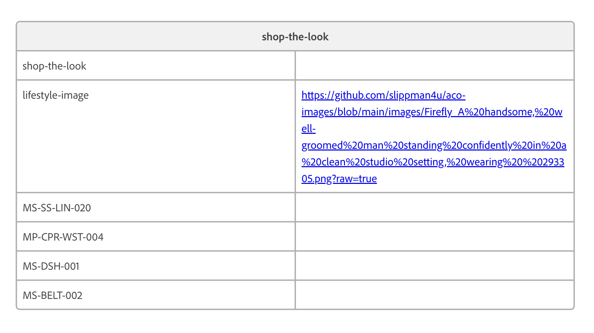

# Shop the Look Block

A product carousel block that displays a curated set of products in a horizontal scrollable slider. Each product tile shows an image, name, price, and a link to the product page.

---

## Setup

### Step 1 — Copy the block files into your project

Copy these 3 files into a folder called `shop-the-look` inside your project's `blocks` folder:

- `shop-the-look.js`
- `shop-the-look.css`
- `README.md`

Commit and push to GitHub.

### Step 2 — Add the block to your page in DA.live

1. Open the page where you want the carousel to appear
2. Insert a new table with 1 column
3. Row 1: type **shop-the-look**
4. Add one row per product — paste the product page URL into each row
5. Click Publish

### Step 3 — Test it

1. Open your live page URL
2. You should see a horizontal product carousel
3. Use the arrows to scroll through the products

---

## Updating products

To change the products displayed, edit the URLs in your DA.live page table and republish. No code changes needed.

