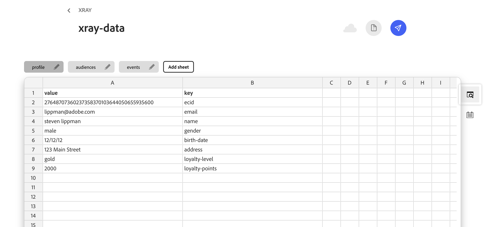
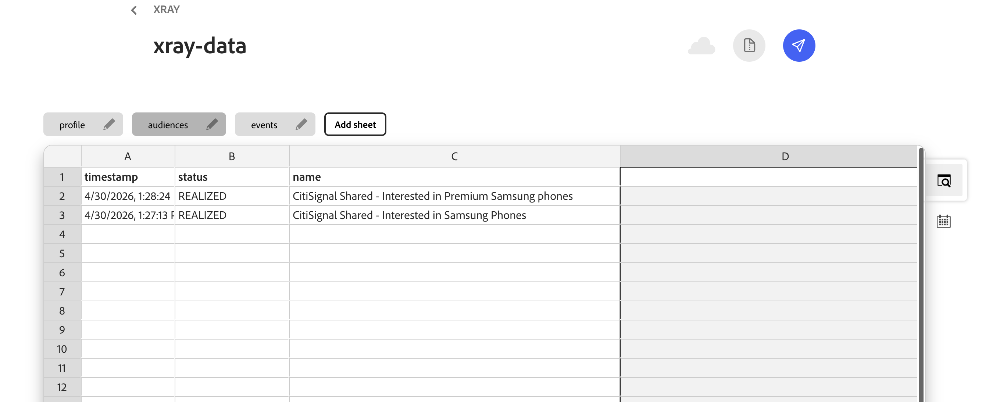
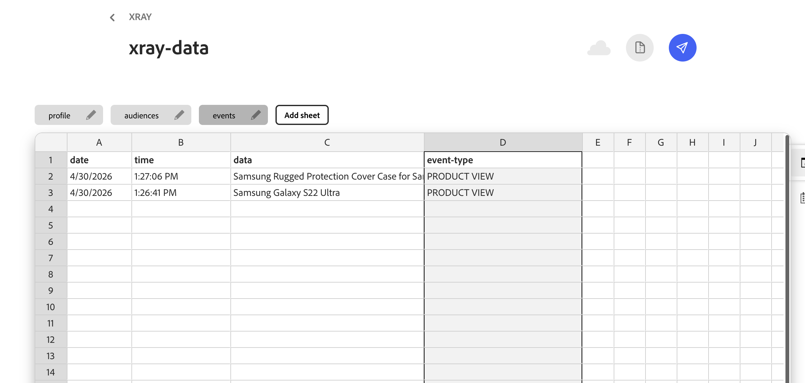
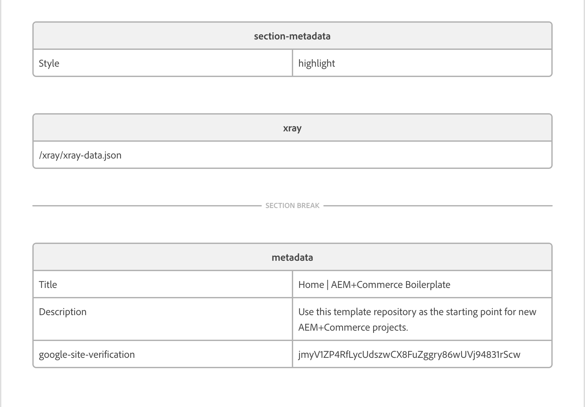

# XRay Block

An AEP-style Real Time Customer Profile viewer that slides in from the left when the Adobe logo button is clicked. Shows profile identities, attributes, audience segments, and behavioral events — all driven by a DA.live spreadsheet.

---

## Setup

### Step 1 — Copy the block files into your project

Copy these 3 files into a folder called `xray` inside your project's `blocks` folder:

- `xray.js`
- `xray.css`
- `README.md`

Commit and push to GitHub.

### Step 2 — Create your data sheet in DA.live

1. Go to your site in DA.live
2. Create a new folder called `xray`
3. Inside that folder create a new Sheet called `xray-data`
4. Create exactly 3 tabs named: `profile`, `audiences`, `events`
5. Copy the column headers and sample rows from the CSV files in the `templates` folder
6. Update the values to match your demo industry vertical
7. Click Publish

**profile tab columns:** `value`, `key`

**audiences tab columns:** `timestamp`, `status`, `name`

**events tab columns:** `date`, `time`, `data`, `event-type`

The `event-type` column can be anything: PRODUCT VIEW, ADD TO CART, LOGIN, CHECKOUT, etc.

### Step 3 — Add the block to your page in DA.live

1. Open the page where you want the panel to appear
2. Scroll to the bottom of the page, above the metadata block
3. Insert a new table with 1 column and 2 rows
4. Row 1: type **xray**
5. Row 2: type **/xray/xray-data.json**
6. Click Publish

### Step 4 — Test it

1. Open your live page URL
2. You should see a small red Adobe A button in the top-left corner
3. Click it — the profile panel slides in from the left
4. Check the Profile and Events tabs to confirm your data is showing

---

## Updating demo data

To change the profile for a different industry vertical, edit the values in your DA.live sheet and republish. No code changes needed.

---

## Templates

Starter CSV files are in the `templates` folder. Use these as the base for your sheet columns and sample rows.
